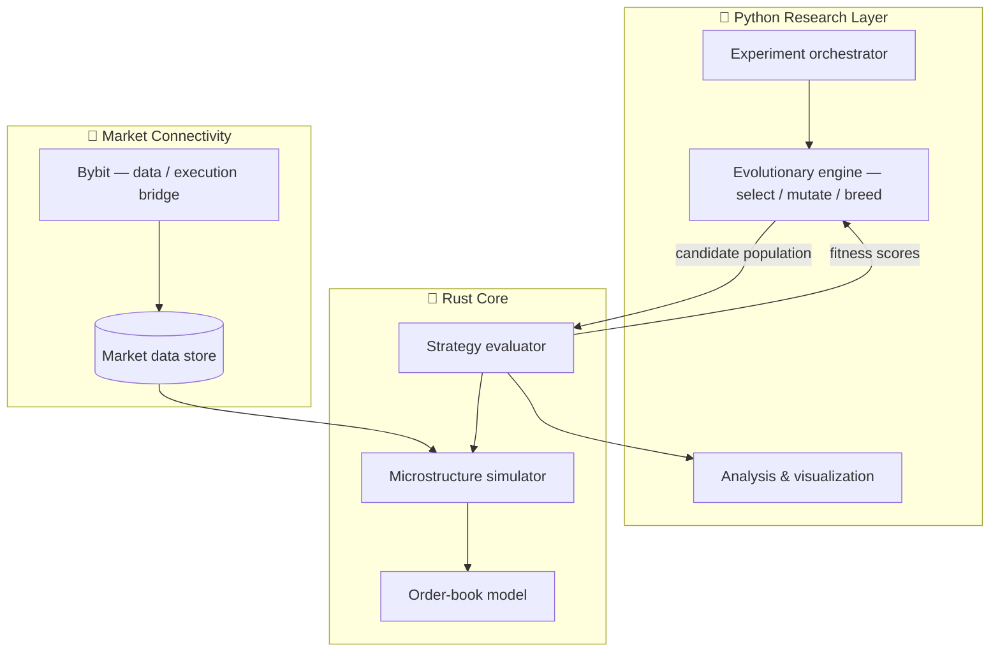
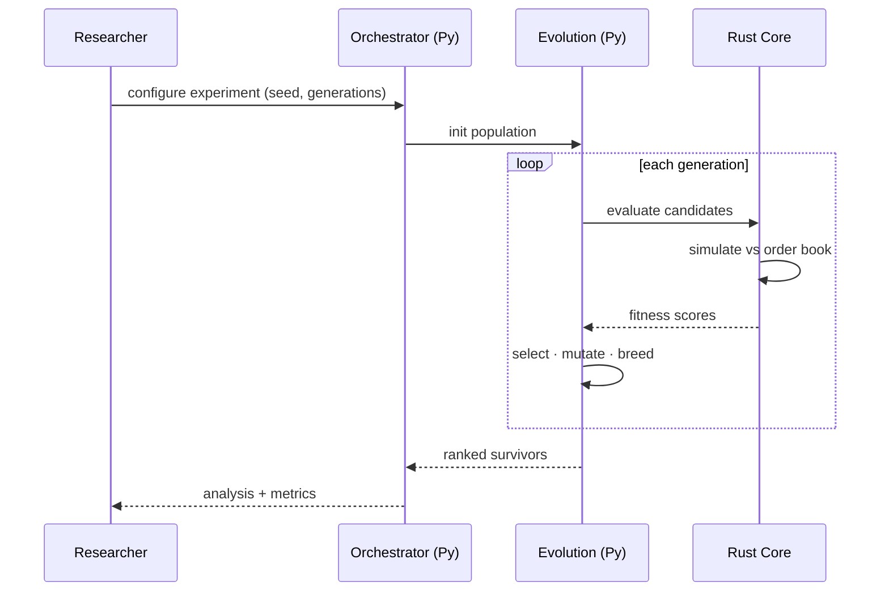
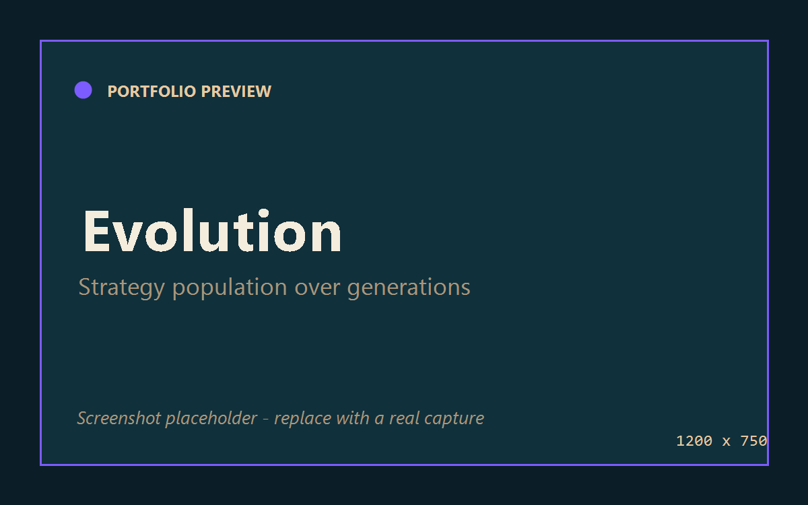
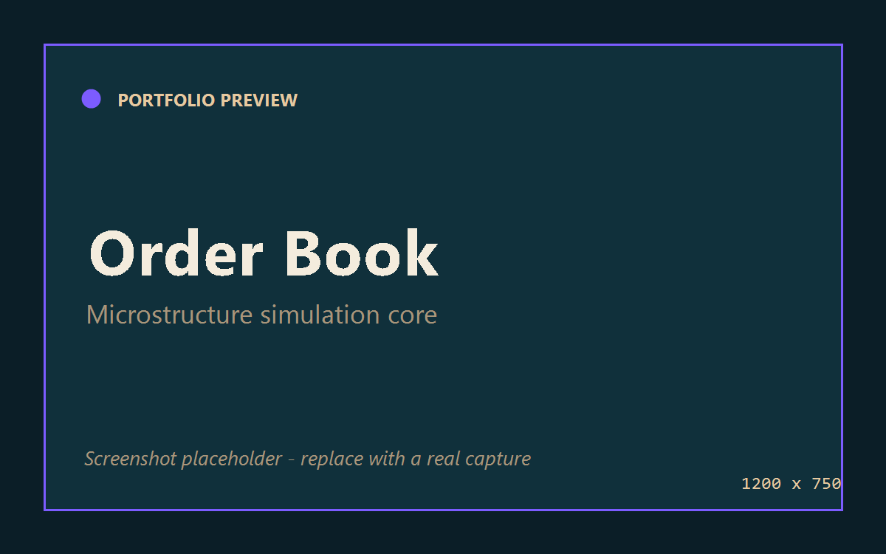
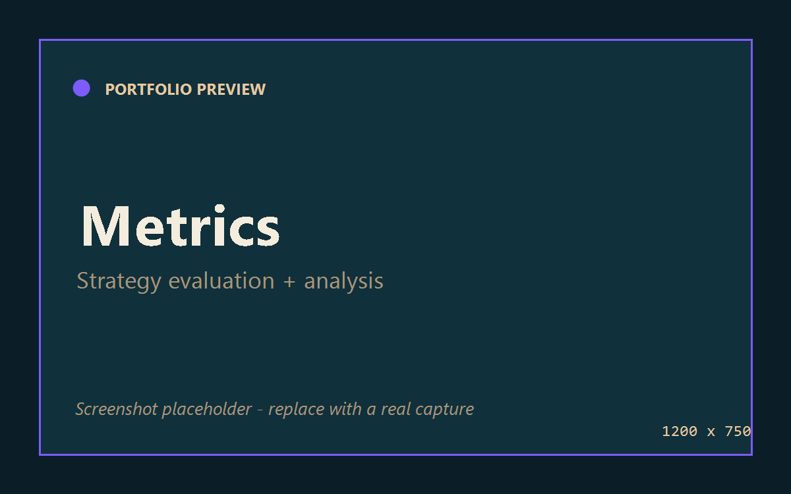

<div align="center">


# ⚡ HFT Research Platform

### Evolutionary strategy generation & market-microstructure simulation.

*A research engine that evolves trading strategies and stress-tests them against a simulated order book — Rust core, Python research layer.*

[](#-development-status)


</div>

> **Public portfolio repository.** This documents architecture and research design only. No strategy logic, parameters, or proprietary source is published. This is a **research framework**, not financial advice and not a signal service. Walkthrough under NDA — **arasghorbani9090@gmail.com**.

---

## 📖 Overview

High-frequency trading lives and dies on **market microstructure** — the moment-to-moment mechanics of the order book, latency, and fills. Hand-tuning strategies against that complexity doesn't scale.

The **HFT Research Platform** treats strategy design as a search problem. An **evolutionary engine** generates and mutates candidate strategies; a **microstructure simulator** evaluates each one against realistic order-book dynamics; the survivors are analyzed, ranked, and iterated. A **Rust core** handles the hot path (simulation, evaluation) while **Python** drives research, orchestration, and analysis. Connectivity to **Bybit** provides real market data and a path from simulation toward live evaluation.

**Goals**
- 🧬 **Discover** strategy structures rather than hand-coding them.
- 🔬 **Evaluate** them under realistic microstructure, not naive backtests.
- 📊 **Understand** *why* a strategy works via reproducible research tooling.

---

## ✨ Features

- 🧬 **Evolutionary strategy generation** — population-based search that mutates and selects candidate strategies over generations.
- 📉 **Market-microstructure simulation** — order-book-aware evaluation modeling fills, queue position, and latency effects.
- 🦀 **Rust execution core** — performance-critical simulation and evaluation in safe, fast Rust.
- 🐍 **Python research layer** — experiment orchestration, analysis, and visualization.
- 🔌 **Bybit integration** — market data ingestion and a bridge from sim toward live evaluation.
- 🧪 **Reproducible experiments** — seeded, configurable runs for honest comparison.

---

## 🏗 Architecture



### Evolutionary research loop



---

## 🧱 Tech Stack

| Layer | Technology |
| --- | --- |
| **Performance core** | Rust (simulation, order book, evaluation) |
| **Research / orchestration** | Python 3.11+ |
| **Search** | Evolutionary / genetic algorithms |
| **Market data & connectivity** | Bybit API |
| **Domain** | Market microstructure, algorithmic trading research |
| **Interop** | Rust ⇄ Python bindings (FFI) |

---

## 📂 Folder Structure

> Representative — illustrative of organization, not a source dump.

```
hft-research-platform/
├── core/                   # Rust crate
│   ├── src/
│   │   ├── orderbook/      # order-book model
│   │   ├── sim/            # microstructure simulation
│   │   └── eval/           # strategy evaluation
│   └── Cargo.toml
├── research/               # Python research layer
│   ├── evolution/          # selection, mutation, breeding
│   ├── experiments/        # configs & runners
│   ├── data/               # Bybit ingestion
│   └── analysis/           # metrics & visualization
├── notebooks/              # exploratory research
└── bindings/               # Rust ⇄ Python interop
```

---

## 🖼 Screenshots

> Placeholders — add captures to `docs/screenshots/`.

| Evolution progress | Order-book sim | Strategy metrics |
| --- | --- | --- |
|  |  |  |

---

## 🗺 Roadmap

- [x] Rust microstructure simulator + order-book model
- [x] Evolutionary strategy generation loop
- [x] Bybit market-data ingestion
- [ ] Richer fill / latency modeling
- [ ] Walk-forward & out-of-sample validation harness
- [ ] Distributed evaluation across populations
- [ ] Live paper-trading bridge (read-only first)
- [ ] Research reporting dashboard

---

## 📈 Development Status

🟣 **Research** — the Rust core and evolutionary loop run end-to-end against simulated microstructure; current work focuses on validation rigor and fill realism. Research framework only — not investment advice.

---

## 🤝 Contact

📧 **arasghorbani9090@gmail.com** · 🔗 [LinkedIn](https://www.linkedin.com/in/aras-ghorbani-ab1a7b62)

<div align="center"><sub>Public architecture & docs. Strategy logic and source are proprietary.</sub></div>
